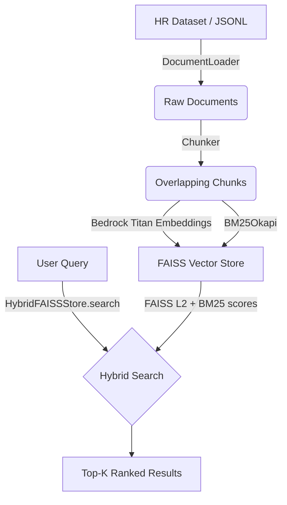
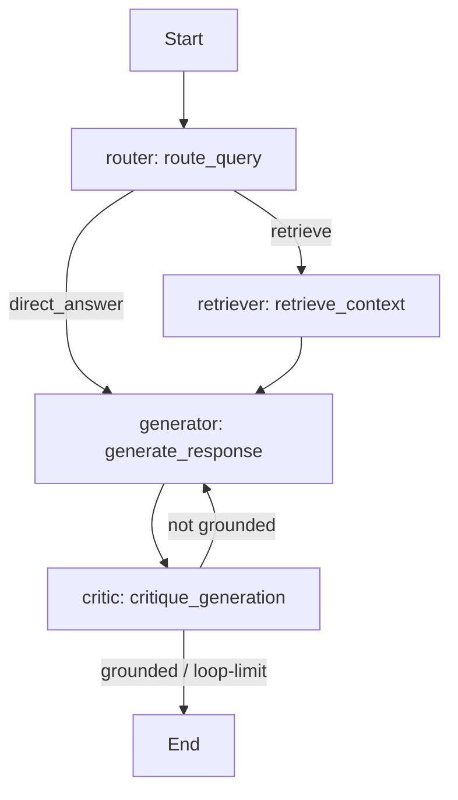
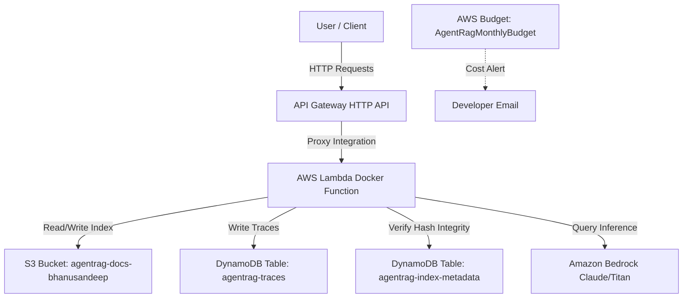

# Architecture

*This document is updated at each milestone. Current state: **M5 — CI/CD Pipeline.***

## Data Flow (M1+)

**Cost Note**: Bedrock Titan text embeddings are used. At ~129k tokens for the HR dataset, the one-time embedding cost is ~$0.003. The FAISS index is stored locally and on S3 (well within the 5 GB free tier).

## Agent Graph (M2+)

Our multi-step agent workflow is orchestrated via `LangGraph`, enforcing structured validation loops for query routing, retrieval, generation, and critique:

## AWS Topology (M4+)

The topology leverages serverless, pay-per-request resources to ensure low-latency API proxying and zero cost-by-default when idle:

### Resource Cost Table

| Resource | Pricing Model | Free Tier Coverage | Monthly Cost Estimate (Idle / Dev) |
|---|---|---|---|
| **API Gateway HTTP API** | Pay-per-request | 1 million requests free per month (1st year) | $0.00 |
| **AWS Lambda** | Pay-per-request | 1 million free requests per month, 400k GB-sec | $0.00 |
| **S3 Bucket** | Storage & Request charges | 5 GB standard storage, 2k PUT/20k GET | $0.00 |
| **DynamoDB Tables** | On-Demand (pay-per-request) | 25 GB storage, 25 WCU, 25 RCU free | $0.00 |
| **AWS Budget** | Alerts | First 2 budgets are free | $0.00 |
| **Amazon Bedrock** | Pay-per-token (on-demand) | None | Pay-per-token (e.g. ~$0.003 for full dataset embeddings) |
| **Total** | | | **~$0.00 (under free tier)** |

## CI/CD Pipeline (M5+)

Continuous Integration (CI) and Continuous Deployment (CD) are automated via GitHub Actions, establishing gatekeeping for security, linting, testing, and deployment:

```mermaid
graph LR
    Push[Git Push / PR] --> Checkout[Checkout Code]
    Checkout --> Setup[Setup Python & Node.js]
    Setup --> Lint[Ruff Lint & Format Check]
    Lint --> TypeCheck[Mypy Strict Type Check]
    TypeCheck --> Audit[Security pip-audit Check]
    Audit --> Test[Pytest Unit Tests & Coverage]
    Test --> CD[CD Deploy Stack to AWS]
    CD -.->|Triggered only on push to main| CDKDeploy[npx cdk deploy]
```

## Observability & Evaluation (M6+)

> Tracing and eval harness documentation to be filled in after M6.
