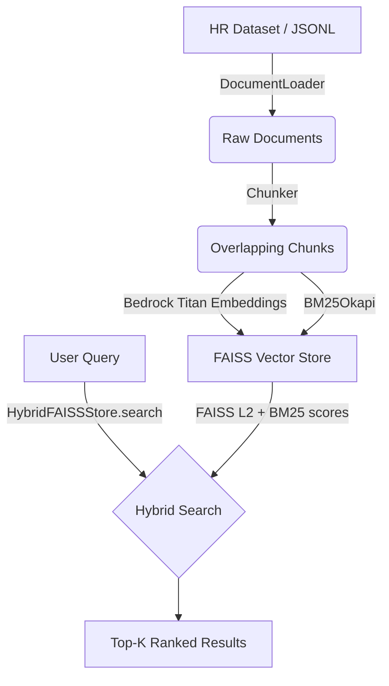

# Architecture

*This document is updated at each milestone. Current state: **M0 — Scaffold.***

## Data Flow (M1+)

**Cost Note**: Bedrock Titan text embeddings are used. At ~129k tokens for the HR dataset, the one-time embedding cost is ~$0.003. The FAISS index is stored locally and on S3 (well within the 5 GB free tier).

## Agent Graph (M2+)

> LangGraph Mermaid diagram to be filled in after M2.

## AWS Topology (M4+)

> CDK resource diagram and per-resource cost table to be filled in after M4.

## Observability & Evaluation (M6+)

> Tracing and eval harness documentation to be filled in after M6.
